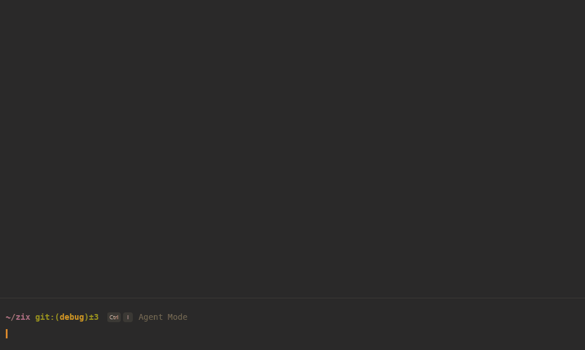

<!-- la cosa es ahora el app.rs
use zix_core::entry::{
    Entry,
    kind::EntryKind
};
use crate::parser::{parse, Opti};
use crate::ref_command::*;

#[cfg(windows)]
use glob::glob;


#[derive(Clone, Debug)]
pub struct App {
    pub entries: Vec<Vec<Entry>>,
    pub name: &'static str,
    pub version: &'static str,
    pub options: Vec<Opti>

}

impl App    {
    pub fn init() -> Option<App>    {
        let mut app = App {
            entries: Vec::new(),
            name: &NAME,
            version: &VERSION,
            options: Vec::new()
        };

        let (options, values) = parse();
        for op in options   {
            match op.as_str()    {
                "--help" | "-?" => { help(); return None},
                "--headers" | "-h" => app.options.push(Opti::Headers),
                "--version" | "-v" => { version(); return None},
                "--all" | "-a" => app.options.push(Opti::All),
                "--list" | "-l" => app.options.push(Opti::List),
                "--tree" | "-t" => app.options.push(Opti::Tree),
                _ => {
                    println!(
                        "'{}' is not a valid option\nType 'zx --help' for more information.",
                        op
                    );
                    return None
                }
            }
        }


        #[cfg(unix)] {
            for val in values.iter() {
                let mut entries: Vec<Entry> = Vec::new();

                match fs::metadata(val) {
                    Ok(metadata) => {
                        if metadata.is_file() {
                            let path = std::path::PathBuf::from(val);
                            if let Some(entry) = create::filter_dir(&path) {
                                entries.push(entry);
                            }
                        } else if metadata.is_dir() {
                            if let Ok(dir) = fs::read_dir(val) {
                                entries.extend(
                                    dir
                                        .filter_map(Result::ok)
                                        .filter_map(|path| create::dir(&path, &app.options))
                                );
                            } else {
                                println!("Cannot read directory: {}", val);
                            }
                        }
                    },
                    Err(_) => println!("Cannot access path: {}", val)
                }

                app.entries.push(entries)
            }
        }

        #[cfg(windows)] {
        for val in values.iter()   {
            let mut entries: Vec<Entry> = Vec::new();

                if val.contains('*')    {
                    if let Ok(paths) = glob(&val) {
                        entries.extend(
                            paths
                                .filter_map(Result::ok)
                                .filter_map(|path| create::filter_dir(&path))
                        );
                    } else {
                        println!("Error interpreting the pattern: {}", val);
                    }
                } else {
                    if let Ok(dir) = fs::read_dir::<&String>(&val)   {
                        entries.extend(
                            dir
                                    .filter_map(Result::ok)
                                    .filter_map(
                                        |path|
                                        create::dir(&path, &app.options)
                                    )
                        );
                   } else {
                       continue;
                   };
                }
                app.entries.push(entries);
            }
        }

        Some(app)
    }
} -->


# zix - an `ls` alternative
## Overview
`zix` is a simple and fast alternative to the traditional Unix `ls` command, designed specifically for Windows. It lists directory contents with a focus on speed and simplicity, aiming to improve the user experience in Windows environments.



## Features
- **Customizable output formats**
- **Cross-platform**: Primarily for Windows, but adaptable for others

## Installation


### Using Cargo (Rust's package manager)
You can easily install `zix` using Cargo by running the following command:

```bash
cargo install zix
```
### Linux (using curl)
You can quickly install zix using curl with our automated installation script:
```bash
curl --proto '=https' --tlsv1.2 -sSf https://raw.githubusercontent.com/zix-rs/zix/refs/heads/main/scripts/install.sh | sh
```

### Windows (using powershell)
If you prefer using PowerShell, you can clone the repository and run an installation script to install zix:

Open PowerShell and run the following command to clone the repository and install zix:
powershell

```bash
powershell -c "irm https://raw.githubusercontent.com/zix-rs/zix/refs/heads/main/scripts/install.ps1|iex"
```

## Usage
Basic usage:
```bash
zx [options] [directory]
```

Example:
```bash
zx -l
```

## Options
META OPTIONS:

    --help, -?
        print help
    --version, -v
        show version of six

DISPLAY OPTIONS:

    --list -l
        detailed list format
    --tree, -t
        recurse into directories as a tree

FILTERING AND SORTING OPTIONS:

    --all, -a
        show hidden and 'dot' files

LONG VIEW OPTIONS:

    --headers, -h
        add a header row to each column

## Contributing
Feel free to [contribute](./CONTRIBUTING.md) by submitting issues or pull requests.


## License
This project is licensed under the [MIT License](./LICENSE).
